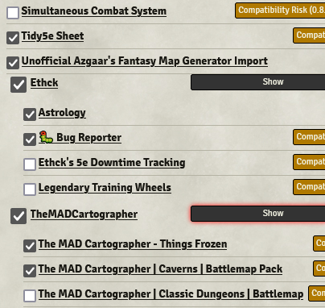
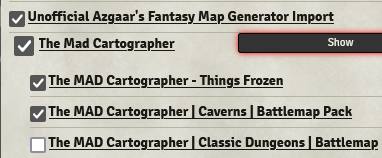

<!--- Downloads @ Latest Badge -->
<!--- replace <user>/<repo> with your username/repository -->
- 

<!--- Forge Bazaar Install % Badge -->
<!--- replace <your-module-name> with the `name` in your manifest -->
- 

# Overview

This module was designed to allow the module enable/disable page to have collapsible sections for modules that are similar to each other. Currently there are two methods to determine this similarity: author and prefix.

## Author

This grouping method just groups modules in the list by their respective author(s).

## Prefix

This grouping method groups modules by determining similar prefixes in the package ids. For example all of the MAD Cartographer's packs start with `mad-`.